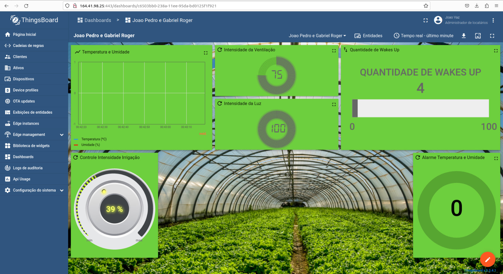

# Trabalho Final - Fundamentos de Sistemas Embarcados - 2023.1 - Turma 01

| Aluno      |        Matrícula           |
| ---------- | ----------------------     |
| [João Pedro de Camargo Vaz](https://github.com/JoaoPedro0803) | 200020650           |
| [Gabriel Roger Amorim da Cruz](https://github.com/GabrielRoger07) | 200018248        |

Ao clicar, é possível ter acesso ao enunciado do [trabalho final](https://gitlab.com/fse_fga/trabalhos-2023_1/trabalho-3-2023-1), que, para a nossa dupla, consistiu na implementação de um sistema para controlar uma estufa de plantas.

O objetivo deste trabalho é criar sensores e atuadores distribuídos baseados nos microcontroladores ESP32 interconectados via Wifi através do protocolo MQTT. Eles controlam a aquisição de dados do sensor [DHT11](https://github.com/Anacron-mb/esp32-DHT11) para exibir ao usuário a temperatura e a umidade da estufa, [Buzzer](https://blogmasterwalkershop.com.br/arduino/como-usar-com-arduino-buzzer-5v-ativo) e [LED RGB](https://portal.vidadesilicio.com.br/como-utilizar-o-led-rgb-com-arduino/) para alertar o usuário caso a temperatura ou a umidade cheguem a valores críticos, [LED RGB](https://portal.vidadesilicio.com.br/como-utilizar-o-led-rgb-com-arduino/) para ativar/desativar o sistema de irrigação, além de [Leds RGB](https://portal.vidadesilicio.com.br/como-utilizar-o-led-rgb-com-arduino/) e o [Encoder Rotativo](https://www.arduinoecia.com.br/como-usar-encoder-rotativo-ky-040-arduino/) para controlar a intensidade da luz e a intensidade da ventilação dentro da estufa.

A ESP número 2 foi implementada no modo bateria, por meio do deep sleep, sendo acordada para funcionar por 1 minuto através do botão BOOT da própria ESP. Já a ESP número 1 opera no modo energia que representa o dispositivo ligado à tomada. 

Toda a comunicação foi implementada via rede Wifi com o protocolo MQTT, onde o controle dos dispositivos ocorre por meio do servidor central no [Thingsboard](https://thingsboard.io/) e os dados de atributos e de telemetria são exibidos no Dashboard da plataforma.

### Informações mais técnicas, como, por exemplo, pinagem etc, podem ser encontrados no README da pasta de cada esp32: [ESP 1](https://github.com/FGA-FSE/trabalho-final-2023-1-gabrieljoao/tree/main/esp1) [ESP 2](https://github.com/FGA-FSE/trabalho-final-2023-1-gabrieljoao/tree/main/esp2)

# Hardware

O hardware para esse repositório possui 2 ESPS32, com diferentes entradas e saídas expostas abaixo:

### ESP 1

- LED RGB (Controle de Irrigação)
- LED RGB (Controle de Temperatura e Umidade)
- DHT11
- Buzzer

### ESP 2

- LED RGB
- Encoder Rotativo (Controle da intensidade da luz)
- Encoder Rotativo (Controle do fluxo de ventilação)

# Observação

O pino de - no LED RGB está invertido, portanto quando for realizar a montagem na protoboard, colocar o pino de - do LED RGB no + da protoboard. 

# Dependências

[Visual Studio Code](https://code.visualstudio.com/)

[ESP-IDF](https://docs.espressif.com/projects/esp-idf/en/v5.0/esp32/get-started/index.html)

[Thingsboard](https://thingsboard.io/)

# Como rodar

1. Clonar o repositório

Primeiramente, é necessário o projeto estar dentro da pasta esp. Em seguida, entrar na pasta da ESP que será executada. Por exemplo, se for executar o código da ESP 1, entrar na pasta esp1:

2. Exporte seu projeto

  `. ~/esp/esp-idf/export.sh`

3. Configure o projeto

	`idf.py menuconfig`

 	1. ##### Menu "Project's Wifi Configuration"

	- `WIFI SSID`, o SSID (nome) da rede usada para se conectar à Internet
	- `password`, a senha da rede
	- `MAXIMUM_RETRY`, número máximo de tentativas de conexão
	
 	2. #### Menu "Serial flasher config"
  
   	- `Flash Size`, altera o Flash size para 4 MB
   	- `Detect flash size when flashing bootloader`, deixa selecionado o Detect flash size when flashing bootloader
  	3. #### Menu "Partition Table"

 	- `Partition Table`, seleciona o Custom partition table CSV
	- `Custom partition table CSV`, altera o nome do arquivo .csv para partition.csv

Em alguns casos, é necessário dar acesso à porta em que a ESP se encontra. Nesse caso, basta rodar o seguinte comando:

4. Acesso à porta ttyUSB0

   `sudo chmod 0777 /dev/ttyUSB0`

5. Compile os códigos-fonte

	`idf.py build`

6. É recomendável limpar a memória flash da esp, com o seguinte comando

	`idf.py -p /dev/ttyUSB0 erase_flash`

7. Execute e monitore

	`idf.py -p /dev/ttyUSB0 flash monitor`

# Dashboard

Segue abaixo o link de acesso para o nosso dashboard:

[Link Dashboard](http://164.41.98.25:443/dashboards/c6503bb0-238a-11ee-95da-bd0125f1f921)

Esta é uma imagem do dashboard do Thingsboard com os dados enviados pelo projeto.

# Vídeo de Demonstração do Sistema
[Link do vídeo disponibilizado no Youtube](https://youtu.be/tKKRpPewd9w)
